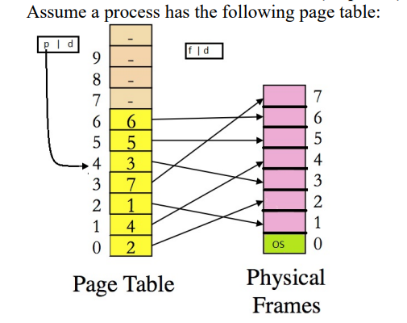

# Logical to Phyisical Memory Address Translation

1. Run make command
2. usage example:  ./translate addresses1 addresses1.output

The reference computing system for this challenge has the following properties: **1K physical memory, 4K virtual memory, and 128 bytes per page and frame**.

Here is a program that takes in only two parameters, an infile, which is a file containing logical memory accesses, and the outfile, which output is written to. 

Each logical address in the infile is saved as 8 bytes (unsigned long) in binary format. The program reads logical addresses and then translates it into 
corresponding physical addresses based on the pagetable data given above. Each logical address in the sequence file, you will use the pagetable given above to 
perform the address translation and generate a corresponding physical address

## Calculate Offset and Page Table Entries
2^12 = 4096K   =>   12 bits = logical virtual memory 
2^10 = 1028K   =>   10 bits = physical memory 
2^7  =  128K   =>    7 bits = offset (d) 
12 - 7 = 5 bits     =>      2^5  = 32 page table entries 

## Example

Logical (12 bit) Address  
0x0BC      {0000 1}{011 1100} => {page table 1}{offset}

Physical (10 bit) Address  
0x23C      {xx10 0}{011 1100}

